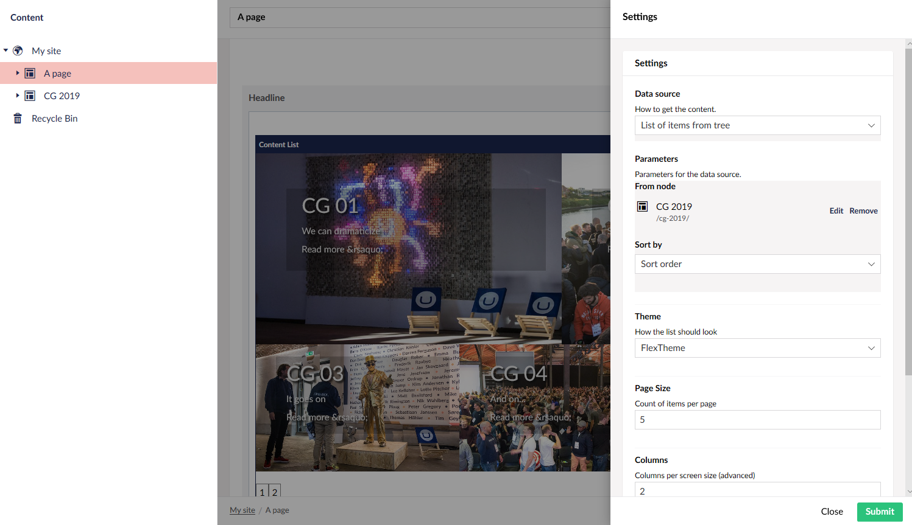
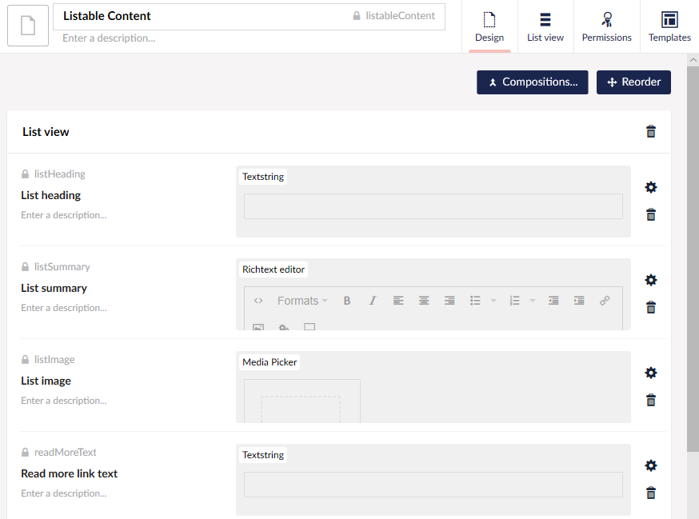
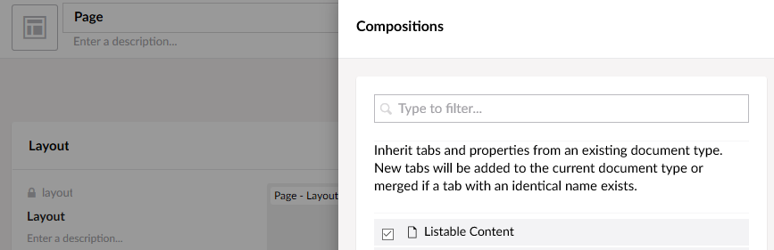
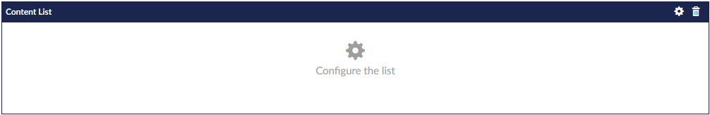
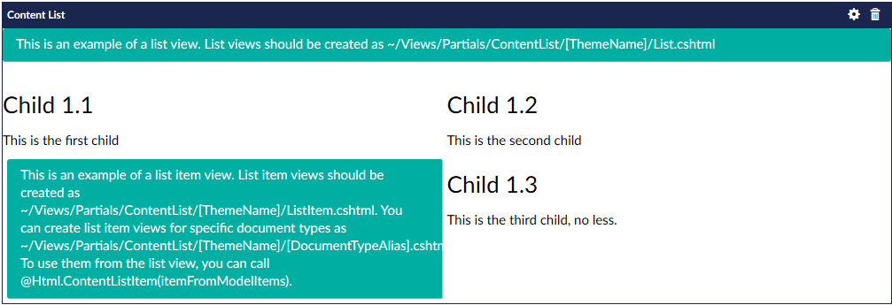

# Our Umbraco Content List

## Overview

An responsive content list component for the Umbraco grid.
Features themable views and extensible data sources.



## Installation

`install-package Our.Umbraco.Community.ContentList -pre`

## Demo

There's a [half an hour demo and tutorial over on youtube](https://youtu.be/7O6Es1SNf9s) for the more visually inclined learners.

## Requirements

The list component is built around an `IListableContent` interface, partially derived from `IPublishedContent`.  
It is meant to be used for _any_ content, not only Umbraco documents.  
However, since most of the properties are called the same as `IPublishedContent` properties,
implementing it is in the best case a matter of "marking" a composition and implementing 2-3 properties.

In order to "mark" a composition the site must use ModelsBuilder, and there must be 
[non-generated C# files complementing the generated models](https://our.umbraco.com/documentation/reference/templating/modelsbuilder/Builder-Modes).  
The recommended mode for content list with ModelsBuilder is `AppData` mode and manual builds.

## Using a composition

A flexible way to use the content list component is to [create a composition](https://our.umbraco.com/documentation/Getting-Started/Data/Defining-content/) 
for the properties that will be used in lists.

Create a new document type without a template called "Listable Content":



Now in a document type used for pages, add the "Listable Content" document type as a composition:



When ModelsBuilder is enabled, the "Listable Content" model is now generated as an interface.  
We can add the "Content List" core interface to the newly generated "Listable Content" composition interface.

## Preparing the models

The "Listable Content" model generated will have a complemetary interface generated from the first 
minute it's used as a composition. We can hook this interface up to the "core" `IListableContent`
interface by adding a partial to the models folder:

```c#
public partial interface IListableContent : Our.Umbraco.ContentList.IListableContent
{
}
```

Note that the core interface has the same name, so it has to be prefixed with its namespace.

There are a select few properties that needs to be implemented specifically since they does not match
the generated model or `IPublishedContent` properties. In order for the model not to break, we have
to implement them on each document type with the composition, including the generated composition model:

```c#
public partial class ListableContent
{
    public string ListImageUrl => ListImage?.Url;
    public string ContentTypeName => ContentType.Alias;
    public DateTime SortDate => CreateDate;
}
```

And for each composed document type:

```c#
public partial class Page
{
    public string ListImageUrl => ListImage?.Url;
    public string ContentTypeName => ContentType.Alias;
    public DateTime SortDate => CreateDate;
}
```

That's it! We can now go into any grid where the Content List editor is enabled and start using it.  
(Remember to build, though. 🙂)

## Adding a content list

When adding a content list editor to a grid, we're presented with a clickable "configure me" prompt.



Clicking the editor, as well as the settings cog, opens the editor settings dialog.  

### Data source

The component comes with four built-in data sources:

- List of children
  - Lists all children with the IListableContent composition or interface
- List of items from tree
  - Adds a parameter for a node from which to list children as above
- XPath query
  - Lists all nodes found from the query, implementing IListableContent
- Lucene query
  - As above, but using a native lucene query instead
  - The lucene source can be mapped to a querystring phrase
  - For a user-input search phrase, the "Lucene query" parameter
    should be used to control or scope the user search.
    The two queries will be anded together.

Most data sources also have a sort parameter that orders by the listed items' property `SortOrder` 
or the property exposed by the `SortDate` property.

You can add your own datasources as well by implementing `IListableDataSource` and registering 
them with the listable content datasource collection builder:

```c#
composition
    .WithCollectionBuilder<ListableDataSourceCollectionBuilder>()
    .Add(typeof(YourType))
```

You can also use the type loader to load all of your data sources at once:

```c#
var allTypes = composition.TypeLoader.GetTypes<IListableDataSource>(specificAssemblies:new []{ GetType().Assembly });
composition
    .WithCollectionBuilder<ListableDataSourceCollectionBuilder>()
    .Add(allTypes);
```

Of course you can also remove built-ins you don't want.

### Data source parameters

Varies by children, but most at least require a sort parameter.

### Theme

The editor comes with a simple sample theme using Bootstrap 3.
It "lives" under `App_Plugins/Our.Umbraco.ContentList/Views/ContentList` and includes some 
instructions on how to build themes.



Of course Bootstrap 3 is not loaded in the backoffice, so it looks a bit weird. It will wrap
correctly in the front-end provided Bootstrap 3 is used.

In any case, all agencies have their favorite CSS framework, so themes are ment for you to build.

The minute ContentList discovers folders under `Views/Partials/ContentList` it will start showing
those as theme options instead of the built-in "Sample" theme.

Inside a theme folder there needs to be at least *one* view called `List.cshtml`.

A very simple Bootstrap 3 theme could be made with the following markup:

```razor
@inherits UmbracoViewPage<ContentListModel>
@using Our.Umbraco.ContentList.Web

<div class="contentlist">
    @foreach(var item in Model.Items)
    {
    <div class="@Model.ColumnStyling.ColumnClasses(" col-sm-", "col-md-" , "col-lg-" ) list-item @item.ContentTypeName ">
         
        <h3>@item.ListHeading</h3>
        <div>@item.ListSummary</div>
        <a href="@item.Url">@item.ReadMoreText</a>
    </div>
    }
</div>
```

There is an extra extension however, enabling us to create different views for each type of listed content.  
By replacing the iterated markup with:

```razor
@Html.ContentListItem(item)
```

The component will look for another view in the theme folder called `ListItem.cshtml`.  
Here's an example of the above content in such view:

```razor
@model Our.Umbraco.ContentList.IListableContent

 
<h3>@Model.ListHeading</h3>
<div>@Model.ListSummary</div>
<a href="@Model.Url">@Model.ReadMoreText</a>
```

Now if we wanted, say a product, to have a different view, we could add another view with the
*content type alias* as its name, and `Html.ContentListItem` will pick that view instead of the default `ListItem.cshtml`.  
The item *will* be of the given type, so it'll be safe to cast the model to a product:


**Product.cshtml**

```razor
@model YourSite.Models.Product

<div class="listed-product">
     
    <h3>@Model.ListHeading</h3>
    <div>@Model.ListSummary</div>
    <a href="@Model.Url">@Model.ReadMoreText</a>
    <div class="huge-price">@Model.Price</div>
</div>
```

For example views, see the [Bootstrap 3 example](Our.Umbraco.ContentList.Web/Views/Partials/ContentList/NiceTheme/List.cshtml)
and [Flexbox example](Our.Umbraco.ContentList.Web/Views/Partials/ContentList/FlexTheme/List.cshtml) in the source code.

#### Limiting a theme to given data sources

To limit a theme to a set of data sources, a `list.json` file can be added to the theme directory:

{
    "compatibleSources": [
        "ListablesByLuceneDataSource",
        "ListableByNodeDataSource"
    ] 
}

As long as there are data source type names in the `compatibleSources` array,
the theme will only be available for those data sources.

### Page Size

Page size limits the count of items shown in a list. See also the "Show paging" parameter.

### Columns

By default the "medium" column count is shown, and is also what is used in the sample preview template.  
Ticking the "Show advanced column settings" box will show three column count boxes: Mobile, Tablet, Desktop.

The `ContentListModel` given to the List view contains a property `ColumnStyling` with those values as
`SmallSize`, `MediumSize` and `LargeSize`. There are a few helper methods to generate different class
names, breaks and such. 
[See the class in the source code](Our.Umbraco.ContentList/Web/ContentListModel.cs#l35) or sample views.

### Show paging

Ticking "show paging" sets a boolean on the `ContentListModel`.

There is a helper in the core assembly that will show a pager if this property is true:
For a Bootstrap styled pager, the following markup can be used. The parameters

```razor
<div class="col-md-12">
    <nav>
        @Html.ContentListPager(Model, pagerClasses: "pagination", pagerElement:"ul", itemElement:"li")
    </nav>
</div>
```

The elements and classes can be changed for use with other CSS frameworks.

There is also a `ContentListPaging` model in the `Paging` property of the `ContentListModel` model
we can use to implement a fully custom pager.

### Skip items

A common use-case is to show the freshest news item as a hero item on the front page for instancce.

In order to exclude that item from a content list further down the page, a number of items can be skipped
by specifying a number to skip.


## Implementing data sources

Data sources are pairs of `IListableDataSource` and `IListableDataSourceMetadata` implementations.

See for instance the core [List of children](Our.Umbraco.ContentList/DataSources/Listables/ListableChildrenDataSource.cs)
implementation for an example.
